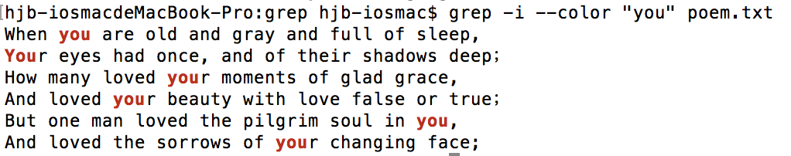

## grep命令详解

如果你是一个新手，请从头阅读这篇文章，如果你只是忘记了grep命令的一些常用选项，直接查看文章尾部的总结部分即可。
 
### 先说说grep命令能做什么？

我们可以使用grep命令在文本中查找指定的字符串，就像你在windows中打开txt文件，使用快捷键 "Ctrl+F" 在文本中查找某个字符串一样，说白了，可以把grep理解成字符查找工具。
 
grep是Linux中最常用的"文本处理工具"之一，grep与<font color=red>sed、awk</font>合称为Linux中的三剑客。

grep的全称为： <font color=red>G</font>lobal search <font color=red>R</font>egular <font color=red>E</font>xpression and <font color=red>P</font>rint out the line
全称中的"Global search"为全局搜索之意。
全称中的"Regular Expression"表示正则表达式。

所以，从grep的全称中可以了解到，grep是一个可以利用"正则表达式"进行"全局搜索"的工具，grep会在文本文件中按照指定的正则进行全局搜索，并将搜索出的行打印出来。

当然，不使用正则表达式时也可以使用grep，但是当grep与正则表达式结合在一起时，威力更强大。

---

我们先来看一个最简单的使用示例，从最简单的示例开始认识grep。
为了实验方便，我们先准备一个测试文件，文件名为poem.txt，文件内容如下。

```text
When you are old and gray and full of sleep,
And nodding by the fire, take down this book,
And slowly read, and dream of the soft look
Your eyes had once, and of their shadows deep；
How many loved your moments of glad grace,
And loved your beauty with love false or true；
But one man loved the pilgrim soul in you,
And loved the sorrows of your changing face;
And bending down beside the glowing bars,
Murmur, a little sadly, how love fled.
And paced upon the mountains overhead,
And hid his face amid a crowd of stars.
```
 
假设，现在我们想要从poem.txt文本文件中搜索包含"you"字符串的行，则可以使用如下命令

`grep "you" poem.txt `
```text
When you are old and gray and full of sleep,
How many loved your moments of glad grace,
And loved your beauty with love false or true；
But one man loved the pilgrim soul in you,
And loved the sorrows of your changing face;
```

上图中的命令表示使用grep命令，在poem.txt文件中搜索包含"you"字符串的行，并将包含you字符串的行打印出来。

于是，poem.txt文件中的第一行被打印了出来，默认情况下，grep是区分大小写的

grep的使用是不是很简单，我们继续聊。
 
如果我们想要在搜索字符串的时候，不区分大小写，应该怎样做呢？grep很贴心，为我们准备了一个选项，使用"-i"选项，即可在搜索时不区分大小写，示例如下：

`grep -i "When" poem.txt`

```text
When you are old and gray and full of sleep,
```

如上所示，在不区分大小写的情况下，由于poem.txt文本中的第一行包含"When"，所以，这行能被打印出来。

由于poem.txt文本中的内容不较少、行比较少，所以，我们能数过来，是第几行包含"test"字符，如果文本中有1000行，我们还想要知道哪行文本包含"you"字符串，则可以使用"-n"选项，表示显示打印出的行在文本中的行号，示例如下：

`grep -i -n "you" poem.txt`
```text 
1:When you are old and gray and full of sleep,
4:Your eyes had once, and of their shadows deep；
5:How many loved your moments of glad grace,
6:And loved your beauty with love false or true；
7:But one man loved the pilgrim soul in you,
8:And loved the sorrows of your changing face;
```

如上图所示，grep不仅将符合条件的行输出了，同时还显示了行号，证明poem.txt文本中的第XX行，在不区分大小写的情况下，都包含字符串"you"。
 
我们使用grep在文本中搜索出的行虽然会被打印了出来，但是在打印这些行时，被匹配到的关键字没有高亮显示，如果我们想要高亮显示行中的关键字，该怎么办呢？我们可以使用"--color"选项，高亮显示行中的关键字，示例如下
注:"--color选项"是长选项

`grep -i --color "you" poem.txt`



使用"--color"与使用"--color=auto"的效果相同，都表示高亮显示关键字，我比较懒，习惯使用"--color"。
 
poem.txt文本中一共有6行包含"you"字符串，如果我们只想知道有多少行包含指定的字符串，而不在乎哪些行包含这些字符串，我们可以使用如下命令，获取到符合条件的总行数。

`grep -i -c "you" poem.txt`
`6`

没错，使用"-c"选项即可只统计符合条件的总行数，而不会打印出行。
 
之前的示例中，包含关键词的行都会被打印出来，整行都会被打印出来，如果我们只想看被匹配到的关键字，不想整行都被打印出来，可以吗？必须的，使用"-o"选项即可只打印出匹配到的关键字，而不打印出整行，示例如下。

`grep -o 'When' poem.txt`
```
When
```

如上图所示，使用"-o"选项，可以只显示被匹配到的关键字，而不是讲整行的内容都输出。
但是需要注意，"-o"选项会把每个匹配到的关键字都单独显示在一行中进行输出，什么意思呢？看如下示例即可明白。

`grep -o -n 'love' poem.txt`
```text
5:love
6:love
love
7:love
8:love
10:love
```
当同一行中包含多个"love"时，所在行会被打印出来，对应的关键字也会高亮显示，当使用了"-o"选项时，每个被匹配到的关键字都会被单独打印在一行中，如上图所示，第三个"love"与第四个"love"都属于第6行的文本，但是它们仍然各自独占一行的输出了。
 
其实，我们在使用grep命令搜索文本时，往往有这种需求：在找到对应的关键字时，同时需要显示关键字附近的信息，什么意思呢？
我们来看一个场景，就能明白，我们新建了一个测试文件：class.txt，测试文件内容如下:
```text
姓名: 小王
班级: 1班
年龄: 4岁

姓名: 小李
班级: 2班
年龄: 5岁

姓名: 小张
班级: 3班
年龄: 6岁
```
假设，我们想从class.txt文件中找出"年龄为5"的人，我们该怎么找呢？你可能会尝试使用如下命令。

`grep '年龄: 5岁' class.txt`
`年龄: 5岁`

如上图所示，我们是匹配到了"年龄: 5岁"的行，但是我们并不能从结果中得知年龄为5岁的人的姓名，因为姓名与年龄并不在一行中，那么我们该怎么办呢？

我们可以使用"-B"选项，显示符合条件的行之前的行，"B"有before之意，示例如下

`grep -B2 '年龄: 5岁' class.txt`

```
姓名: 小李
班级: 2班
年龄: 5岁
```

如上图所示，包含字符串"年龄: 5岁"的行被高亮输出了，同时，符合条件的行"之前的2行"也被打印了出来，这时，我们就能从结果中得知，小李今年五岁，在2班读书

上例中的"-B2"选项表示显示符合条件的行的同时还显示之前的2行，"-B"选项的后面必须有数字，否则会报错。
 
与"-B"选项对应的选项是"-A"选项，"-B"有Before之意，"-A"有After之意，聪明如你，一定已经猜到了"-A"的含义，没错，"-A"代表显示符合条件的行的同时，还要显示之后的行，"-A3"表示同时显示符合条件的行之后的3行，我就不再赘述了。
 
说了"-A"，说了"-B"，现在说说"-C"，"-C"选项可以理解为"-A与-B"的结合，"-C"选项表示在显示符合条件的行的同时，也会显 示其前后的行，如"-C1"，"-C1"表示打印符合条件的行的同时，也打印出之前的一行与之后的一行，"-C"有Context之意（上下文之意），示例如下。

`grep -C1 '班级: 2班' class.txt`
```text
姓名: 小李
班级: 2班
年龄: 5岁
```
 
有的时候，我们往往需要进行所谓的"精确匹配"，但是使用之前的方法似乎无法满足我们，示例如下。

`grep 'in' poem.txt`

```text
And nodding by the fire, take down this book,
But one man loved the pilgrim soul in you,
And loved the sorrows of your changing face;
And bending down beside the glowing bars,
And paced upon the mountains overhead,
```

上图中，当我们在文本中搜索"in"字符串的时候，"nodding"、"changing"、"bending"所在的行都被匹配到了，因为"nodding"中也包含了"in"，所以也被匹配到了，但是当我们想要"精确匹配"in字符串的时候，按照上例中的方法就无法做到了，所谓的精确匹配，就是"in"作为一个独立的单词存在，而不是包含于某个字符串中，那么，如果有这种需求，我们怎么办呢？使用"-w"选项可以实现我们的需求，示例如下。

`grep -w 'in' poem.txt` 
```
But one man loved the pilgrim soul in you,
```

如上图所示，只有"in"作为一个独立的单词存在的时候，才会被匹配到，"in"包含于某个字符串的时候，则不会被匹配到，这就是所谓的精确匹配，"-w"有word之意，表示搜索的字符串作为一个独立的单词时才会被匹配到。
 
有的时候，我们需要反向查找，比如，查找"不包含某个字符串"的行，这个时候，我们需要用到"-v"选项，示例如下。

grep命令详解
上例表示查找出文本中不包含"in"字符串的行。

`grep -v 'in' poem.txt`

查找包含中文的部分（简单举例）

`grep -v -E '[A-Za-z]+' poem.txt `
```
当你老了，白发苍苍，睡思昏沉，
在炉火旁打盹，请取下这部诗歌，
慢慢读，回想你过去眼神的柔和，
回想它们昔日阴影的浓重；
多少人爱你年轻欢畅的时刻，
出于假意或真心地爱慕你的美貌；
只有一个人爱你那朝圣者的灵魂，
爱你逐渐老去的脸上痛苦的皱纹；
躬身在火光闪耀的炉火旁，
凄然地低语那爱的消逝，
在头顶的山上，爱缓缓踱着步子，
将脸隐没在群星之中。
```
 
某些场景下，我们可能想要同时从多个目标中匹配，什么意思呢？看了示例就秒懂，示例如下。

`grep -e '小王' -e '小张'  class.txt`
```
姓名: 小王
姓名: 小张
```

上例中，我们同时在文本中搜索了"小王"与"小张"，包含这两个字符串中任意一个的行都会被打印出来，没错，就像上图中的示例一样，使用"-e"选项可以同时匹配多个目标，多个目标之间存在"或"关系，即匹配其中的任意一个都算作匹配成功。
 
在写脚本时，你可能只是想要利用grep判断文本中是否存在某个字符串，你只关心有没有匹配到，而不关心匹配到的内容，你只关心有，或者没有，这时，我们可以使用grep的静默模式，示例如下。

`grep -q 'When' poem.txt`
`echo $?`
`0`

`grep -q 'WhenWhen' poem.txt`
`echo $?`
`1`


当使用"-q"选项时，表示grep使用静默模式，静默模式下grep不会输入任何信息，无论是否匹配到指定的字符串，都不会输出任何信息，所以， 我们需要配合"echo \$?"命令，查看命令的执行状态，如果返回值为0，证明上一条grep命令匹配到了指定的字符串，如果返回值为1，则证明上一条grep命令没有匹配到指 定的字符串，就像上图示例中显示的那样，静默模式下，grep没有输出任何信息，当我们在poem.txt文本中查找"When"字符串时，可以匹配到结果，当在文本中查找"WhenWhen"字符串的时候，没有匹配到结果，所以，我们只关心有没有匹配到指定字符时，可以使用"-q"选项，但是需要配合"echo \$?"命令查看执行状态。

文章开头说了，grep可以利用正则表达式进行搜索，但是之前的举例中，grep都没有使用正则表达式，只是纯粹的去查找一些字符串，这次，我们使用grep命令，配合正则表达式，来查找我们想要的目标。
比如，我们想要查找某个文本中的合法邮箱，示例如下:

```
cat mail.txt
hello@12345
hello@163.com
@12345.com
@12345.cn
```

`grep -E '^[a-zA-Z0-9_-]+@[a-zA-Z0-9_-]+(\.[a-zA-Z0-9_-]+)+$' mail.txt`
```
hello@163.com
```

眼尖的你肯定发现了，上例的正则表达式为扩展正则表达式，而不是基础正则表达式，所以，在上述命令中，我使用了"-E"选项。
在使用"-E"选项时，grep才支持"扩展正则表达式"，不使用"-E"选项时，grep默认只支持"基本正则表达式"。
 
不同的开发语言中，正则表达式的规则可能略有不同，我们在使用grep时，可以使用"-P"选项，指明使用perl兼容的正则表达式。
 
好了，grep的常用选项我们已经总结完毕，剩下需要做的就是不断的练习了。
其实，除了grep命令，其实还有egrep命令，还有fgrep命令（fast grep），它们有各自的特点。
 
grep：支持基本正则表达式
egrep：支持扩展正则表达式，相当于grep -E
fgrep：不支持正则表达式，只能匹配写死的字符串，但是速度奇快，效率高，fastgrep
 
### 总结

为了方便以后回顾，将grep的常用选项总结如下
 
--color=auto 或者 --color：表示对匹配到的文本着色显示  
-i：在搜索的时候忽略大小写  
-n：显示结果所在行号  
-c：统计匹配到的行数，注意，是匹配到的总行数，不是匹配到的次数  
-o：只显示符合条件的字符串，但是不整行显示，每个符合条件的字符串单独显示一行
-v：输出不带关键字的行（反向查询，反向匹配）  
-w：匹配整个单词，如果是字符串中包含这个单词，则不作匹配  
-Ax：在输出的时候包含结果所在行之后的指定行数，这里指之后的x行，A：after  
-Bx：在输出的时候包含结果所在行之前的指定行数，这里指之前的x行，B：before  
-Cx：在输出的时候包含结果所在行之前和之后的指定行数，这里指之前和之后的x行，C：context  
-e：实现多个选项的匹配，逻辑or关系  
-q：静默模式，不输出任何信息，当我们只关心有没有匹配到，却不关心匹配到什么内容时，我们可以使用此命令，然后，使用"echo $?"查看是否匹配到，0表示匹配到，1表示没有匹配到。  
-P：表示使用兼容perl的正则引擎。  
-E：使用扩展正则表达式，而不是基本正则表达式，在使用"-E"选项时，相当于使用egrep。  

